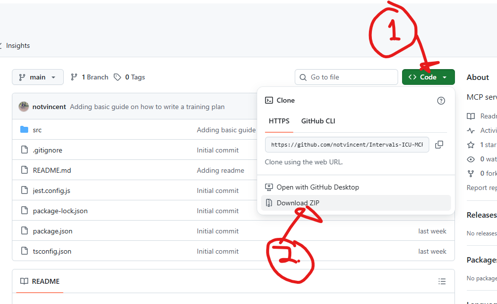
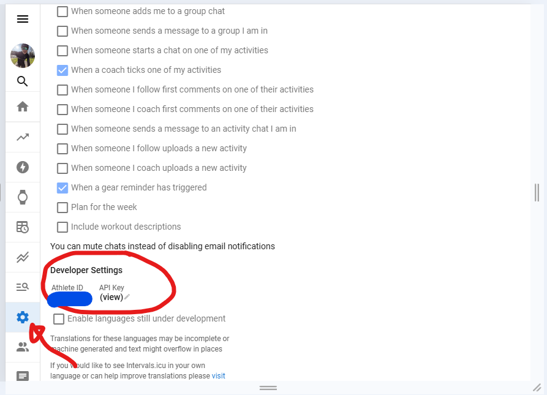
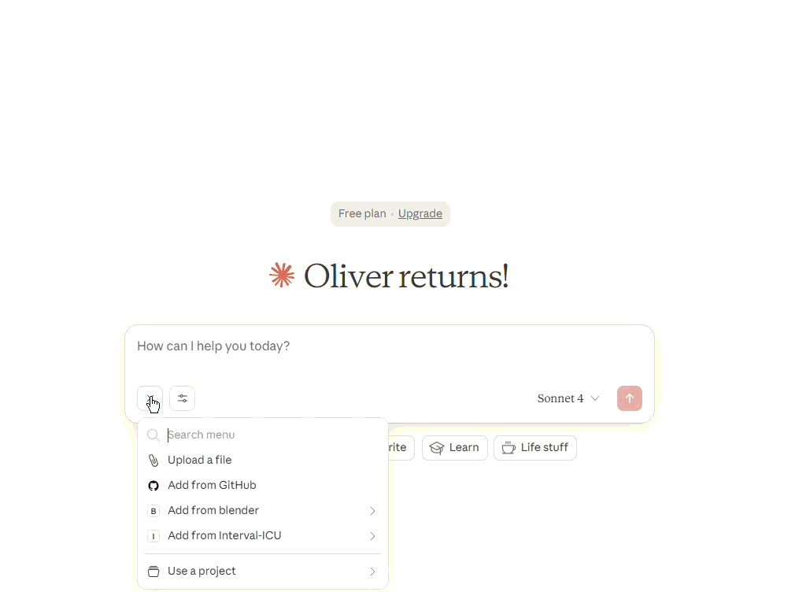

# Intervals.icu MCP Server

A Model Context Protocol (MCP) server that provides tools for managing workouts and events on [Intervals.icu](https://intervals.icu). This server allows AI assistants to create, list, update, and delete training events through the Intervals.icu API.

## Features

- **CreateWorkouts**: Create multiple planned workouts with structured training descriptions
- **ListEvents**: Retrieve events (workouts, notes, etc.) from your calendar with filtering options
- **UpdateEvent**: Modify existing workout events by ID
- **DeleteEvents**: Remove multiple events by their IDs

## Prerequisites

- Node.js
- An Intervals.icu account
- Intervals.icu API key


## Setup for techincal people (if you have coding experience)

1. Add the following to your mcp configuration depending on what you are trying to run from

#### VSCode GH copilot

```json
//  .vscode/mcp.json
{
	"servers": {
		"interval-icu-server": {
			"type": "stdio",
			"command": "npm",
			"args": [
				"start"
			],
			"env": {
				"ATHLETE_ID": "", // YOUR API KEY AND ID
				"API_KEY": ""
			}
		}
	},
	"inputs": []
}
```

#### Claude
```json
{
    "Interval-ICU": {
        "command": "npx",
        "args":["tsx", "PATH_TO_PROJECT\\IntervalsMcp\\src\\main.ts"],
		"env": {
			"ATHLETE_ID": "", // YOUR API KEY AND ID
			"API_KEY": ""
		}
    }
}
```

### Setup for non techincal people

1. Download and unzip all the code files

1. It will be easiest for you to use claude.ai as your chatbot which you can install [here](https://claude.ai/download). The free tier will be good enough for you to get it to do a couple actions per day with it. I am in no way associated with claude.ai, but I do think they have a good product.
2. Get your API key and athlete ID from intervals.icu, it can be found in the settings page, NEVER share your API key with anybody, it is essentially equivalent to your account password.

3. Follow [claude's instructions](https://modelcontextprotocol.io/docs/develop/connect-local-servers) on how to setup an MCP server. The one KEY difference is, for the third step you will use this configuration:

```json
// For windows machines
{
    "Interval-ICU": {
        "command": "npx",
        "args":["tsx", "PATH_TO_PROJECT\\IntervalsMcp\\src\\main.ts"], // Put the full path to the main.ts file
		"env": {
			"ATHLETE_ID": "", // Put your athlete ID from step 2 here
			"API_KEY": "" // Put your API key from step 2 here
		}
    }
}
```

```json
// For mac machines
{
    "Interval-ICU": {
        "command": "npx",
        "args":["tsx", "PATH_TO_PROJECT/IntervalsMcp/src/main.ts"],
		"env": {
			"ATHLETE_ID": "", // Put your athlete ID from step 2 here
			"API_KEY": "" // Put your API key from step 2 here
		}
    }
}
```
5. Open your terminal, navigate to the IntervalsMcp folder and run this command:
```
npm install
```
6. Once you've done this you can restart claude and it should be able to interact with intervals.icu. Try asking it a question like "Give me a 2h threshold workout in interval.icu for tomorrow"
7. If you want to try the training plan builder you can do so like this:
